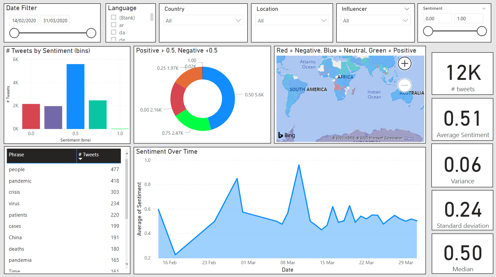

# SocialAnalytics
The Social Analytics tool is designed to demonstrate and deliver a tool that can take feeds from Twitter (and potentially other social networks) and use machine learning to extract sentiment and key topics from the data.
The tool also includes a PowerBI desktop report that you can then deploy to your PowerBI cloud space for distribution within your company.

Below are the steps to follow to deploy the tool to your own Azure tenant.

Notes:

- The PowerShell script below references a file called SetupVariables.json which is not included in the repository. You will need to create this file locally with the following format and in the same directory as the PowerShell script:

        `{`  
            `"subname":"<name of the Azure subscription>",`  
            `"location":"<data centre location for resources>",`  
            `"resourcegroupname":"<name of the resource group to use/create>",`  
            `"sqlservername":"<name of the Azure sql server do not include azure domain name>",`  
            `"sqldbname":"<name of the sql database>",`  
            `"bing_maps_key":"<a key for the bing maps search at https://www.bingmapsportal.com/>",`  
            `"twitter_search_term":"<a search term. use a narrow seacrh term that suits your needs>",`  
            `"text_analytics_domain":"<the globally unique domain name for the text analytics cognitive servcice in Azure, i.e. the name before cognitiveservices.azure.com>",`  
            `"text_analytics_name":"<name of the text analytics cognitive service, doesn't need to be globally unique >"`,
            `"text_analytics_tier":"<name of the pricing tier for the text analytics cognitive service, F0, S, S0, S1 , S2, S3 or S4 see https://azure.microsoft.com/en-gb/pricing/details/cognitive-services/text-analytics/ >"`
        `}`  

- The PowerShell script will create all resources required, including the resource group

- It is important that you use a narrow search term for 'twitter_search_term' as the twitter search api only returns 100 tweets at a time you will not get a good sample if the search term is not narrow. For example, this sentiment analysis tool was orginally developed to help organisations with social analytics during the COVID-19 crisis. On it's own this term is very broad, so instead use COVID-19 Countryname to look for tweets specific to a certain country or COVID-19 brandname to search for tweets specific to a certain brand name.

## Steps to Setup

### Create Azure Resources
The Azure resources are created using a PowerShell script and ARM json templates. Please make sure you maintain the folder structure from GitHub otherwise the script will fail to run.
 - Open the PowerShell Script using your editor of choice
 - Update the variables at the start of the script. Pay attention to some of the notes in comments
 - Run the script, paying attention to any inputs asked. These may be security credentials so please remember them.
 - Make sure the PowerShell script has run successfully, before continuing

### Update SQL Schema
Now that we all of our Azure resources, including the SQL Database, we now need to update the database schema. [TODO: update PowerShell to incorporate this step]
- Go to the Azure portal and find the resource group created from the previous step. You should see quite a few resources within this group including a SQL server, a sql database, a number of API connections and a umber of logic apps.
- Click on the SQL database resource
- From the resource menu click 'Query Editor' and login using the credentials used in the previous step.
- If this step fails due to a firewall issue then copy the IP address given and click 'Set server Firewall'
- Create a new firewall rule for this IP address and click save. Then close this blade to reveal the previous Query Editor blade.
- Click OK and this time the query editor should open successfully.
- Copy the contents of 'generatedbobjects.sql' found in the 'Data\AzureSQLDatabase' folder and run.
- Ensure the query runs without any errors. You can close the query editor window without saving.
### Authenticate the Connections
As part of creating the Azure resources step a number of API connections were created. You now need to authenticate each of these.
- Return to the resource group created in previous steps.
- Open the twitter API connection, the status should be 'unauthenticated'
- Click on 'Edit API Connection'
- Click on 'Authorize' and connect a twitter account.
- Click 'Save'
- Return to the resource group created in previous steps.
- Open the Text Analytics cognitive service and make note of 'Key1' and 'Endpoint'
- Return to the resource group created in previous steps.
- Open the Text Analytics API connection, the status should be 'error'
- Click on 'Edit API Connection'
- Enter the account key and Site Url.
- Click 'Save'
- Return to the resource group created in previous steps.
- Open the SQL api connection
- Click on 'Edit API Connection'
- Enter the username and password that you used during the PowerShell script execution
- Click 'Save' [NOTE: (26Mar2020) You may need to click 'Save' twice until you see the notification to indicate it has been saved]
### Update Logic Apps
Now that everything is setup, our Logic Apps, should now work correctly, but they will be disabled.
- Return to the resource group created in previous steps.
- Open the Bing locations logic app and click the 'Enable' button
- Now click the 'Edit' button and then 'Run'
- Stay in the editor and wait to see the run complete successfully
- Return to the resource group and repeat this procedure for all logic apps in the resource group.
### Test Everything
- To test everything is working query the sql database by reviewing the results of each of the views: viewLocation, viewTweets and view Phrases
- Within viewLocations you should start to see records with BingLocation populated. This won't be the case for all records as users can add whatever location they want in twitter.
- After some time check the run history of both logic apps to ensure they are performing correctly.

### Setup the PowerBI Desktop report
- Open the pbix file located under the Reports folder and save into a local folder somewhere. 
- If you are asked to authenticate just click cancel and close the error dialog that follows.
- Click on the 'Edit Queries' button to enter the power query editor.
- Hit the 'Data source settings' button, then click change source and enter the full sql database server name.
- Make sure your client IP address has been added to the firewall settings of the sql database using the Azure portal
- Then click 'Edit Permissions' on the data source settings dialog and update the sql connection details.
- Click 'OK' and 'Close' and the 'Refresh Preview'
- Assuming this all works click 'Close and Apply'
- On the main PowerBI dialog click Refresh

### Common Issues
- When running the twitter logic app if you get an error at the search tweets step, just click in and click 'change connection' then select the twitter connection and rerun

  